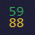
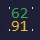

# Thermal Control Center for Dell G15 (and others)

Open-source alternative to AWCC*

[Download link](https://github.com/AlexIII/tcc-g15/releases) *(Note: the app requires administrator privileges)*


<br/>

> Liked the app? Glad you did! 😸 Help by spreading the word 🚀 and leaving the project a star ⭐

> Didn't work out for you? Please report the problem by creating an [issue](https://github.com/AlexIII/tcc-g15/issues). Feedback is always welcome!

**AWCC - "Alienware Control Center" is an app for thermal control that Dell ships with their G-series notebooks.*

## Target Platform

OS: Windows 10/11.

Supported models (as reported by the users):
- Dell G15: 5511, 5515, 5520, 5525, 5530, 5535, 5590
- Dell Alienware m16 R1
- Dell G3 3590
- Alienware 16X Aurora

May also work on other Dell G15 / Alienware laptops.

Please report if it worked / didn't work for you. Your feedback is highly appreciated.

## What It Can Do

- ✔️ Switch thermal mode between G-mode, Balanced, and Custom
- ✔️ Show GPU/CPU temperature and fan speed
- ✔️ Semi-manual fan speed control
- ✔️ Option to automatically enable G-mode when GPU/CPU temperature reaches critical
- ✔️ Support for keyboard G-mode hotkey

## UI hints

- The white dots ("stars") in the corners of the tray icon indicate current G mode state.

    
    G mode is Off
    <br>
    
    G mode is On

- Hover mouse pointer over a UI element to see its description

## Limitations

- Requires admin system privileges (to access WMI interface)
- Manual fan control is not *really* manual. If you set fan speed too low, the BIOS will take over and raise the fan speed automatically when the GPU/CPU temperature reaches a certain point to prevent overheating.
- **"Autorun on startup" feature may not work for you.** The autorun adds a task to the Windows Task Scheduler that should start the app on first sign-in after a reboot, but it may fail to run the app due to the system's security policy. You can try other approaches to make the app autostart on your system. [Check out this issue.](https://github.com/AlexIII/tcc-g15/issues/7)
- On rare occasions, the driver may report bogus GPU temperature. [See this issue.](https://github.com/AlexIII/tcc-g15/issues/9)
- Switching the thermal mode to "G-mode" and back **may result in a second-long system-wide freeze** (at the exact moment when the switch is happening). This is a known issue with Dell's thermal control interface. Cannot be fixed. Make sure to disable the fail-safe feature if you don't want the app to switch the thermal mode automatically.

## Why AWCC is BAD

- ❌ AWCC has no in-program option to enable/disable G-mode
- ❌ AWCC manual fan control is broken at this moment
- ❌ AWCC is a bulky, slow, and visually noisy app that can't even handle basic functions
- ❌ [AWCC is spying on you](#about-the-awcc-telemetry)
- ❌ AWCC sometimes randomly crashes and throws crash reports

If this alternative works out for you, you can safely remove from your PC:

- Alieanware CC Components
- Alieanware Command Center Suite
- Alieanware OC Controls

## How It Works

It is a PyQt-based GUI for the WMI Dell thermal control interface.

I have somewhat documented my findings on the WMI [here](WMI-AWCC-doc.md).

## How to Run from the Source

```
python3 -m pip install -r ./requirements.txt
python3 src\tcc-g15.py
```

## About the AWCC Telemetry

I know it's probably not going to surprise anyone, given the times we're living in, 
but AWCC silently sends some telemetry without the possibility of opting out.

The telemetry is being sent to these URLs:

```
https://tm-sdk.platinumai.net
https://qa-external-tm.plawebsvc01.net
```

## Credits

Big thanks to the amazing people who have contributed to the project:
- @AprDeci for code / new features
- @T7imal, @cemkaya-mpi, @THSLP13, @Terryxtl for testing and debugging
- @Dtwpurple, @WinterholdPrime, @Dhia-zorai, @fraPCI for compatibility reports

## Changelog

- 1.6.5
  - Update dependencies (dev)
  - Update imports (dev)
  - Fix: handle incompatible mode settings (dev)

- 1.6.4
  - Fix: do not limit displayed RPM value

- 1.6.3
  - Add tray icon tooltip (show current temperatures, fan speeds, thermal mode)
  - Add tray icon G mode indication
  - Add switching thermal mode from tray context menu
  - Fix: adaptive tray icon size (fixes blurry tray icon on high resolution screens)
  - Fix: faster app startup

- 1.6.2
    - Show GPU/CPU model in the app (fixed from 1.6.1)
    - Small bug fixes

- 1.6.0
  - Add support for keyboard G-mode hotkey

- 1.5.4
  - Fix saving settings on app abnormal exit (system shutdown, etc)
  - Fix reset to default settings

- 1.5.3
  - Add trigger delay for fail-safe to smooth-out temp spikes

## License

© github.com/AlexIII

GPL v3
