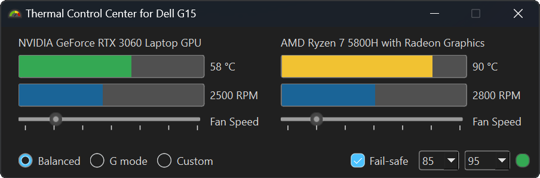

# Thermal Control Center for Dell G15 5515

Open-source alternative to AWCC*

[Download link](https://github.com/AlexIII/tcc-g15/releases) *(Note: the app requires to be run as administrator)*




Tested only for Dell G15 5515. May also work on other Dell G15 notebooks.

Please report if it worked / didn't work for you. Your feedback is highly appreciated.

**AWCC - "Alienware Control Center" is an app for thermal control that Dell ships with their G-series notebooks.*

## What it can do

- ✔️ Switch thermal mode between G-mode, Balanced and Custom
- ✔️ Shows GPU/CPU temperature and fan speed
- ✔️ Semi-manual fan speed control
- ✔️ An option to automatically enable G-mode when GPU/CPU temperature reaches critical

## Limitations

- Requires Admin system privileges (in order to access WMI interface) 
- Manual fan contoll is not *really* manual. If you set fan speed too low the BIOS will takeover and raise the fan speed automatically when the GPU/CPU themerrature reaches certain point to prevent overheating. 

## Why AWCC is BAD

- ❌ AWCC has no in-program option to enable/disable G-mode
- ❌ AWCC manual fan control is broken as per this moment
- ❌ AWCC is bulky, slow and visually noisy app that can't even handle basic functions
- ❌ [AWCC is spying on you](#about-the-awcc-telemetry)
- ❌ AWCC sometimes randomly crashes and throws crash reports

If this alternative works out for you, you can safely remove from your PC:

- Alieanware CC Components
- Alieanware Command Center Suite
- Alieanware OC Controls

## TO-DO

I'll implement these things if the project receives sufficient number of stars*

- ✔️ Minimize to tray (10x ⭐)
- ✔️ Save settings between restarts (20x ⭐)
- [[see issue](https://github.com/AlexIII/tcc-g15/issues/7)] Autorun on system startup option (30x ⭐)
- "Target temperature mode" - automatically control the fans to maintain user-specified GPU/CPU temperature (40x ⭐)
- Proper Windows installer (50x ⭐)

*or maybe I'll do it regardless, who knows.

## Target platfom

Tested with Dell G15 5515 on Windows 10.

## How it works

It is a PyQt based GUI for WMI Dell thermal control interface.

I somewhat documented my findings on the WMI [here](WMI-AWCC-doc.md).

## How to run from the source

```
python3 -m pip install -r ./requirements.txt
python3 tcc-g15.py
```

## About the AWCC telemetry

I know it's probably not gonna surprise anyone, giving the times we're living in, 
but AWCC silently sends some telemetry without the possibility of opting-out.

The telemetry is being sent to these URLs:

```
https://tm-sdk.platinumai.net
https://qa-external-tm.plawebsvc01.net
```

## Licence

© github.com/AlexIII

GPL v3
